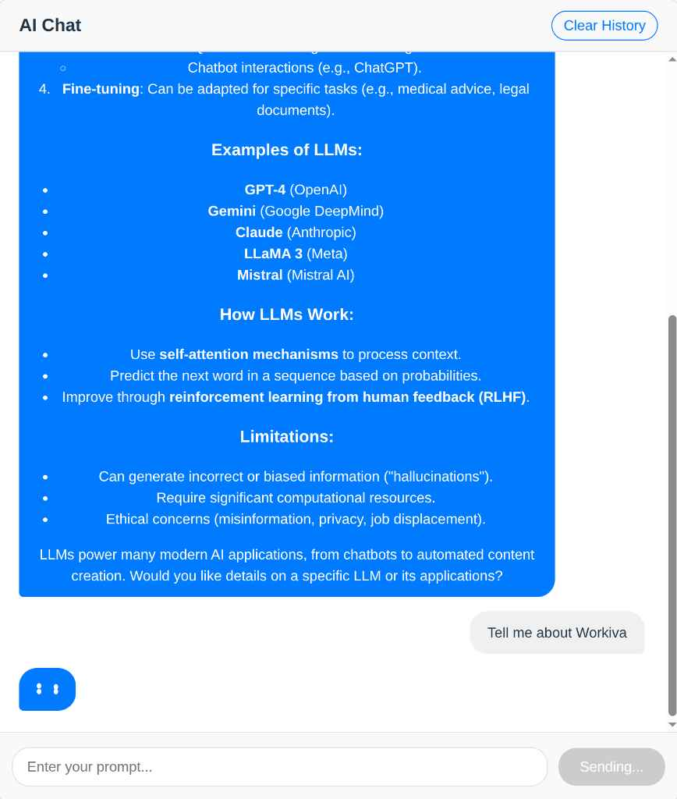

# AI Chat Interface



A sleek and modern web application that provides a chat interface to interact with an AI model from the Hugging Face Inference API. This project was built to demonstrate a clean UI, solid frontend architecture, and core principles of modern web development.

## Features

-   **Interactive AI Chat**: Engage in a conversation with an AI assistant.
-   **Clean & Modern UI**: Aesthetically pleasing interface that supports both light and dark modes based on your system preference.
-   **Chat History**: Your conversation is automatically saved to your browser's local storage.
-   **Markdown Support**: AI responses are rendered as Markdown, supporting code blocks, lists, links, and more.
-   **State Management**: Gracefully handles loading, error, and empty states.
-   **Clear History**: A simple one-click button to clear the entire conversation.
-   **Responsive Design**: Looks great on both desktop and mobile devices.

## Tech Stack & Architecture

This project is built with a focus on maintainability and scalability, utilizing a modern tech stack and a well-defined architecture.

-   **Framework**: [React](https://reactjs.org/)
-   **Build Tool**: [Vite](https://vitejs.dev/)
-   **AI Service**: [Hugging Face Inference API](https://huggingface.co/inference-api)
-   **Markdown Rendering**: [react-markdown](https://github.com/remarkjs/react-markdown) with [remark-gfm](https://github.com/remarkjs/remark-gfm)

### Architecture Highlights

-   **Component-Driven**: The UI is broken down into small, reusable components (`Header`, `ChatHistory`, `PromptForm`).
-   **Custom Hooks**: All business logic and state management are encapsulated within a custom hook (`useChat`), keeping components clean and focused on rendering.
-   **Service Layer**: API interactions are abstracted into a dedicated service (`aiService.js`), decoupling the application from the specific API implementation.

## Getting Started

Follow these steps to set up and run the project locally.

### Prerequisites

-   [Node.js](https://nodejs.org/) (v18.x or newer)
-   [npm](https://www.npmjs.com/) (or your preferred package manager)
-   A Hugging Face API Token. You can get one from your [Hugging Face account settings](https://huggingface.co/settings/tokens).

### Installation & Setup

1.  **Install dependencies:**
    ```bash
    npm install
    ```

2.  **Set up environment variables:**

    Create a file named `.env` in the root of your project and add your Hugging Face API token:

    ```env
    VITE_HF_TOKEN="your_hugging_face_api_token_here"
    ```

    *Note: The `.env` file is included in `.gitignore` to prevent your API key from being committed to version control.*

3.  **Run the development server:**
    ```bash
    npm run dev
    ```

The application should now be running on `http://localhost:5173`.
